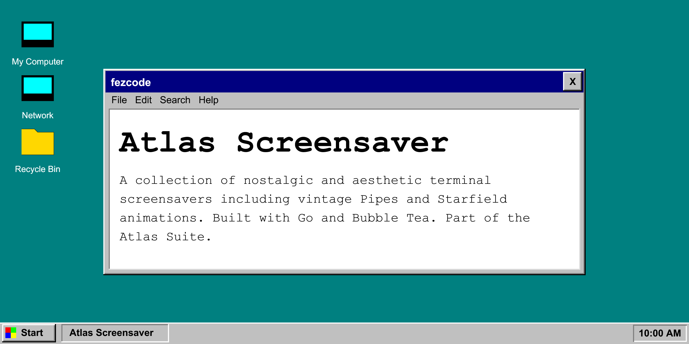

# atlas.screensaver 📺



**atlas.screensaver** is a collection of nostalgic and aesthetic terminal screensavers. Part of the **Atlas Suite**, it brings classic visualizers like vintage Pipes and Starfield animations to your modern terminal with a clean "Onyx & Gold" touch.


## ✨ Features

- 🛠️ **Multiple Modes:** Choose between classic Pipes, 3D Starfield, or Random mode.
- 🎨 **Aesthetic Colors:** Vibrant, high-visibility colors that match the Atlas Suite theme.
- ⌨️ **Interactive TUI:** Simple menu to select your preferred visualizer.
- 🏎️ **Smooth Animation:** Optimized frame rates for a fluid terminal experience.
- 📦 **Zero Dependencies:** Compiles to a single portable binary.

## 🚀 Installation

### Recommended: Via Atlas Hub
The easiest way to install is using the central hub:
```bash
atlas.hub
```
Select `atlas.screensaver` from the list and confirm.

### From Source
```bash
git clone https://github.com/fezcode/atlas.screensaver
cd atlas.screensaver
gobake build
```

## ⌨️ Usage

Simply run the binary to open the selection menu:
```bash
./atlas.screensaver
```

### Controls
| Key | Action |
|-----|--------|
| `↑/↓` / `j/k` | **Navigate:** Move through menu options. |
| `Enter` | **Select:** Start the screensaver. |
| `Esc` / `q` | **Back/Exit:** Return to menu or quit. |
| `Ctrl+C` | **Quit:** Exit the application. |

## 🏗️ Building

The project uses **gobake** for orchestration:

```bash
# Build for all platforms
gobake build
```

## 📄 License
MIT License - see [LICENSE](LICENSE) for details.
